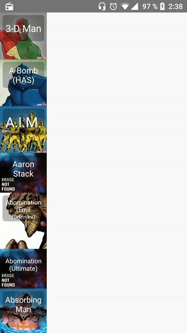

# Api-Marvel-Connect

Ejemplo de conexión con la INTERACTIVE API TESTER de MARVER: https://developer.marvel.com/docs


### Pre-requisitos 📋

Debe escribir la PUBLIC_KEY y PRIVATE_KEY en la clases Api.kt.

```
private const val PUBLIC_KEY = "PUBLIC_KEY";
private const val PRIVATE_KEY = "PRIVATE_KEY";
```

## Ejecutando las pruebas ⚙️

Se realizan prueba unitaria para la parte de la Api. Podemos encontrar estas pruebas en UnitTest.kt

## Vistas

Se implementa diferente vista para diferentes modelos de dispositivo, vista para tablet y para smartphone

| Tablet | smartphone |
| :---: | :---: | 
|  |  |

## Autores ✒️

* **Ivan Fernández Bermejo** - *Integro* - [Ivanfbermejo](https://github.com/Ivanfbermejo)

También puedes mirar la lista de todos los [contribuyentes](https://github.com/your/project/contributors) quíenes han participado en este proyecto.
